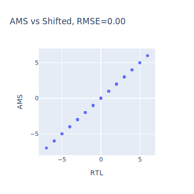

# Charge-Redistribution based accelerator in 22nm (the digital part)

This repository contains the digital design for a 22nm Charge-Redistribution In-memory Computing based accelerator with a 10T1C SRAM bitcell.

For now, has a 128x128 IMC subarray with a 4-bit ADC. See [No citation yet] for the accelerator design.

### Running Tests

The following command will test all RTL files:
`pytest tests`

You should run a test before moving on to Cadence AMS simulations to create the necessary input files.

Tests are executed using Pytest. The test infrastructure:
1. Compiles and runs SystemVerilog testbenches using Cadence xrun
2. Generates log files in `tests/logs/`
3. Verifies test success by checking for "TEST SUCCESS" in the output
## Testing Infrastructure

The repository includes a comprehensive testing setup for the QR Accelerator design

### Test Files
- `tb_column.sv`: SystemVerilog testbench for testing the column-level functionality
- `test_tb_column.py`: Python test runner that executes the SystemVerilog testbenches using Cadence xrun

### Key Components Under Test
- QR Accelerator wrapper (`qr_acc_wrapper.sv`) which includes:
  - ADC encoding with 15-bit input to multi-level output (-5 to 7)
  - Switch matrix control logic
  - MAC (Multiply-Accumulate) interface
  - SRAM interface with read/write capabilities


```python
# Run all tests of all testbenches
python -m pytest tests
# Or
python -m pytest tests/test_tb_column.py
```

### Required Tools
- Cadence xrun simulator
- Python 3.x
- SystemVerilog compatible simulator

### Latest Simulations:

1b Module (qr_acc_wrapper.py) RTL vs AMS




### Results notes

| CSV | Notes |
|--|--|
| 1.csv | Initial AMS where the testing settings were on binary mode but the circuit was in bipolar |
| 2.csv | After putting the testing into binary mode. Now is off by +-1 sometimes. Reason could be that shifting rounds to -infty but this doesn't. |
| 3.csv | Comparison against rounded, also corrected ADC ref range. Now only the rounding is biased low. |