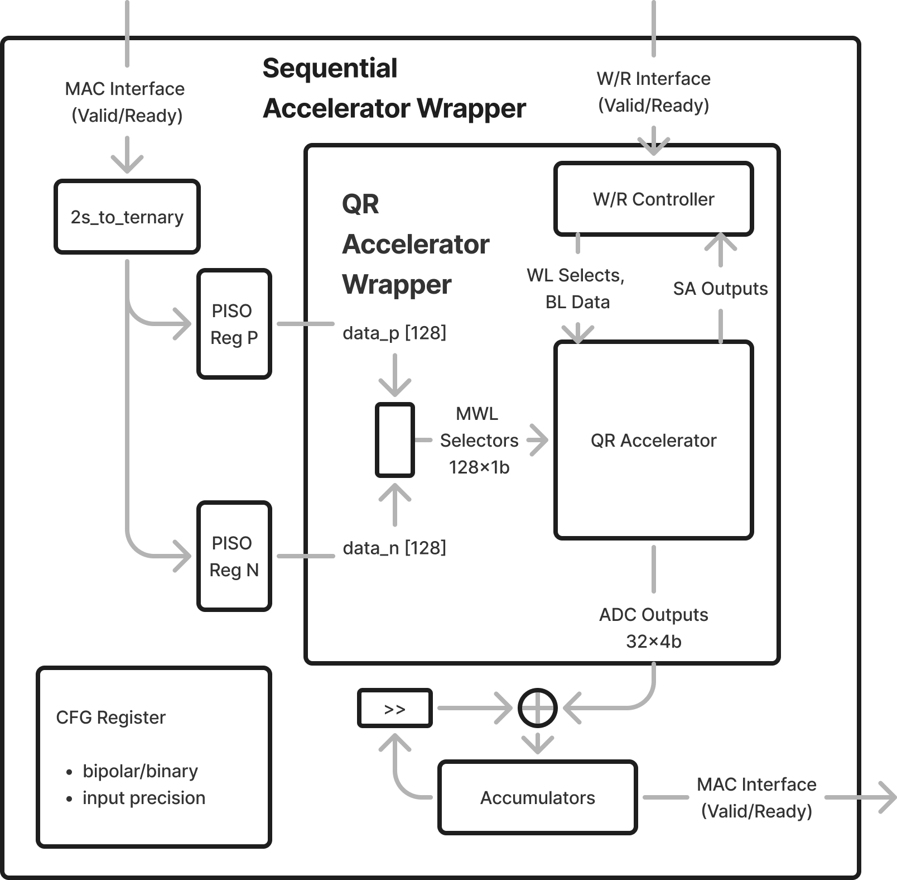
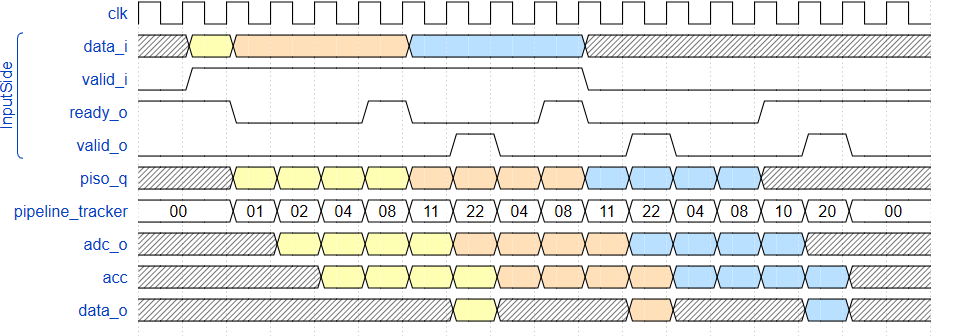

# Charge-Redistribution based accelerator in 22nm (the digital part)

This repository contains the digital design for a 22nm Charge-Redistribution In-memory Computing based accelerator with a 10T1C SRAM bitcell.

Implements QR-based IMC with a 128x32 10T1C SRAM subarray with a 4-bit ADC.

See the [results](results.md) document to get a rundown of metrics.

## Setup

Setup a working conda or [mamba](https://mamba.readthedocs.io/en/latest/installation/mamba-installation.html) installation.

1. `conda env create --file=env.yml`

To run VCS or XCelium simulations:
1. Setup a terminal that works with either simulator first. 
2. Create a .env file: `env > .env`

This step should allow pytest to find the programs correctly everytime.

## Running Tests

The following command will test all RTL files:
`pytest`

You should run a test before moving on to Cadence AMS simulations to create the necessary input files.

Tests are executed using Pytest. The test infrastructure:
1. Compiles and runs SystemVerilog testbenches using Cadence xrun
2. Generates log files in `tests/logs/`
3. Verifies test success by checking for "TEST SUCCESS" in the output

## Testing Infrastructure

The repository includes a comprehensive testing setup for the QR Accelerator design

### Test Files
- `tb_column.sv`: SystemVerilog testbench for testing ts_column (single ADC column)
- `tb_qr_acc.sv`: SystemVerilog testbench for testing the main QR Accelerator wrapper
- `tb_seq_acc.sv`: SystemVerilog testbench for testing sequential accumulator module
- `test_rtl.py`: Pytest files that performs input generation pre-test and post-test data processing. Runs the simulators as subprocess.

### Key Components Under Test
- QR Accelerator wrapper (`qr_acc_wrapper.sv`) which includes:
  - ADC encoding with 15-bit input to multi-level output (-5 to 7)
  - Switch matrix control logic
  - MAC (Multiply-Accumulate) interface
  - SRAM interface with read/write capabilities

```python
# Run all tests of all testbenches
python -m pytest
# Or specific parts
python -m pytest -k qracc # or seq_acc or column or ams
```

### Required Tools
- Cadence xrun simulator
- Python 3.x
- SystemVerilog compatible simulator

### Latest Simulations:

1b Module (qr_acc_wrapper.py) RTL vs AMS


### sec_acc datapath





### Results notes

* The binary mode seq_acc output can have disastrously bad SNR (~9dB) with only slight changes (~3-4dB) in the qrAcc result. The result seems to immediately shoot up to ~20dB SNR if the qrAcc result is improved. Is this a fact of life on noisy 4b inputs accumulated into an 8b input? Is there a jump in 8b SNR when the 4b SNR is swept?

## Todo

* Replace default parameters with compiler directives