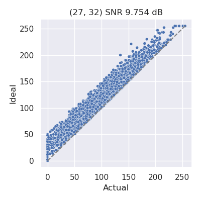
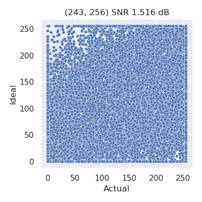
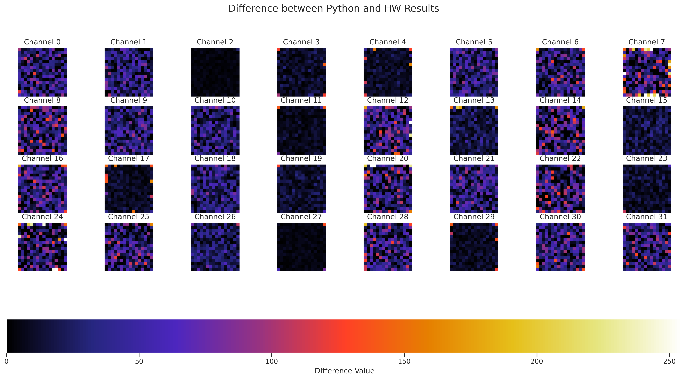
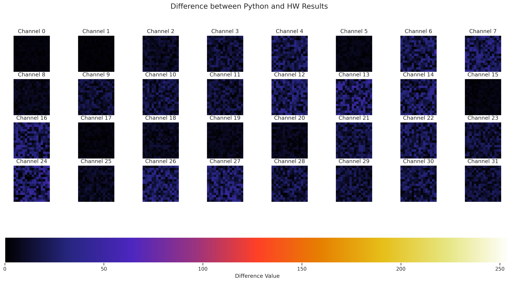

# Results

## Bipolar Scatter Plots
|   | RTL | AMS |
|---|-----|-----|
| QR Accelerator |  |  |
| Sequential Accelerator |  |  |

## Binary Scatter Plots
|   | RTL | AMS |
|---|-----|-----|
| QR Accelerator |  |  |
| Sequential Accelerator |  |  |

## QRAccLinearConv Scatter Plots
| Test Name         | ifmap_shape      | kernel_shape    | core_shape   | padding | stride | Scatter Plot Image |
|-------------------|-----------------|-----------------|--------------|---------|--------|--------------------|
| singlebank        | (1, 3, 16, 16)  | (32, 3, 3, 3)   | (256, 32)    | 1       | 1      |  |
| morethan32fload   | (1, 16, 16, 16) | (32, 16, 3, 3)  | (256, 32)    | 1       | 1      |  |
| fc_smallload      | (1, 3, 16, 16)  | (32, 3, 3, 3)   | (256, 256)   | 1       | 1      |  |
| fc_fullload       | (1, 27, 16, 16) | (256, 27, 3, 3) | (256, 256)   | 1       | 1      |  |
| fc_wideload       | (1, 3, 16, 16)  | (48, 3, 3, 3)   | (256, 256)   | 1       | 1      |  |

## QRAccLinearConv Per-Channel Difference Plots
| Test Name         | ifmap_shape      | kernel_shape    | core_shape   | padding | stride | Per-Channel Plot Image |
|-------------------|-----------------|-----------------|--------------|---------|--------|------------------------|
| singlebank        | (1, 3, 16, 16)  | (32, 3, 3, 3)   | (256, 32)    | 1       | 1      |  |
| morethan32fload   | (1, 16, 16, 16) | (32, 16, 3, 3)  | (256, 32)    | 1       | 1      |  |
| fc_smallload      | (1, 3, 16, 16)  | (32, 3, 3, 3)   | (256, 256)   | 1       | 1      |  |
| fc_fullload       | (1, 27, 16, 16) | (256, 27, 3, 3) | (256, 256)   | 1       | 1      |  |
| fc_wideload       | (1, 3, 16, 16)  | (48, 3, 3, 3)   | (256, 256)   | 1       | 1      |  |

## Results Tables

|       |Throughput       |Energy Efficiency  (1b TOPS/W)   |Power      |
|---|----|----|---|
|Analog Only |$409.6$ GOPS | $516.1$ TOPS/W | $793.6 \mu W$ |

## Comparison Table

| Metric | Biswas 2019 | C3SRAM 2020 | This work |
|--------|-------------|-------------|------------|
| Technology | 65nm | 65nm | 22nm |
| Cell Type | 10T | 8T1C | 10T1C |
| Operating Voltage | 1.2V (DAC)/ 0.8V (Array)/ 1V (rest) | 1V (Array)/ 0.8V (Driver)/ 0.6V (ADC) | 0.8V (All) |
| Memory Capacity | 2 kB | 2 kB | 512B |
| Input Precision | 6 | 1 | 1-8 |
| Weight Precision | 1 | 1 | 1 |
| Output Precision | 6 | 5 | 4-8 |
| Efficiency (TOPS/W) | 40.3 | 671.5 | 516.1 |
| Throughput (GOPS) | 8 | 1,638 | 409.6 |